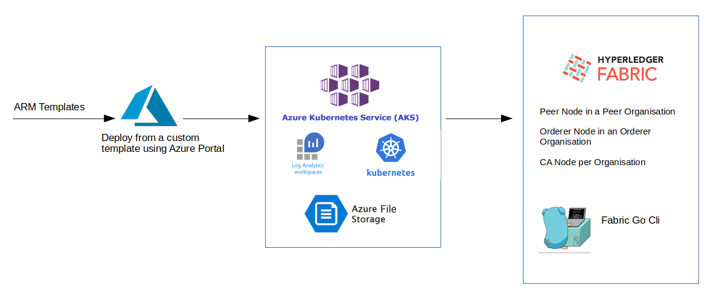

# Infrastructure Deployment

This page describes the steps needed to deploy the infrastructure without the Marketplace offering route.

## Requirements

The following requirements need to be met:

* Subscriptions with HLF preview enabled
* CA Certificates for HLF
* Storage Account created and with a container

## Manual deployment





- Hyperledger Fabric 2.2 network which is made up of a Peer Cluster and an Orderer Cluster that gets deployed separately and gets connected post deployment facilitated with IaaS model using Microsoft ARM template.

- This application is based on Azure Blockchain as a Service using ARM code which is available as opensource for HL 1.4 on Github.


## Services and Deployments 🛠

```
    Peer Node in a Peer Organisation
    Orderer Node in an Orderer Organisation
    CA Node per Organisation
    Fabric Go Cli 
    Log Analytics on Azure
    Container Insights on Azure
    Storage Account for Azure
```

## Generating and Uploading marketplace artifacts 🛠
### Clone the git repo

`git clone https://github.com/hiteshdutt/Hyperledger-Fabric-on-Azure-Kubernetes-Cluster.git`

### Navigate to the scripts directory

`cd Hyperledger-Fabric-on-Azure-Kubernetes-Cluster/scripts`


### Execute the generateArtifacts.sh script

`bash generateArtifacts.sh <yourrepo>/<imageName>:<version>`

An example, assuming your repo name is "hlfdemo", image name is "fabrictools" and version is 1.0

`bash generateArtifacts.sh hlfdemo/fabrictools:1.0`

### Upload/Push the Genentated Artifacts
- login to your container registory, Example : if your account is in docker hub, please use command `docker login` and follow instructions

`bash uploadArtifacts.sh <storage account Name> <container name> <storage account key> <yourrepo>/<imageName>:<version>` 

- An example for upload documents (just for reference, this will work once demo values are replaced with actual information)

`bash uploadArtifacts.sh demostoragename democontainer xxxxxxx`

#### Important
- The artifacts are generated at `Hyperledger-Fabric-on-Azure-Kubernetes-Cluster/out`. The contents in the `out` directory should be uploaded to a location that can be accessed by the template. While uploading, the directory structure should not be changed.

## Create Connection Profiles
  - Continue the deployment by creating connection profiles.
 - [Profiles](CreatingProfiles.md)
